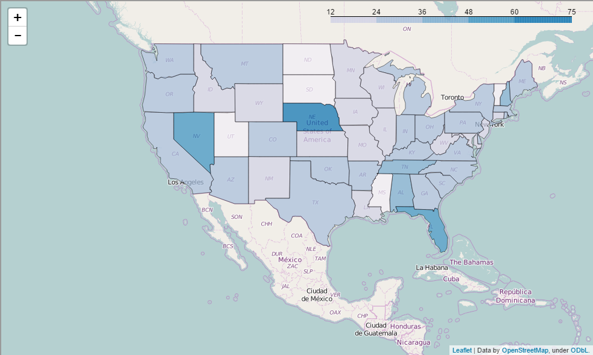

# Trump Tweets Data Exploration Project

This project analyzes the tweets by Donald Trump to determine which ones become popular (i.e., are retweeted or favorited). 

The data set includes over 3200 tweets from Donald Trump, as well as geographical information for over 9200 retweets of these tweets from his supporters. I examine factors including the words used in tweets, the sentiment of tweets, the topics of tweets, and where users are retweeting from.

I have determined that there is a small but highly significant correlation between the sentiment of tweets and how much they are retweeted; a highly negative tweet will get approximately 5,000 more retweets than a neutral tweet, and a neutral tweet will get approximately 5,000 more retweets than a highly positive tweet.

I have also found that the state in which user resides is highly relevant. See this map below:

(Note that the Jupyter Notebook shows much of the work, but is unable to display the maps. Those can be seen in the markdown version.)
